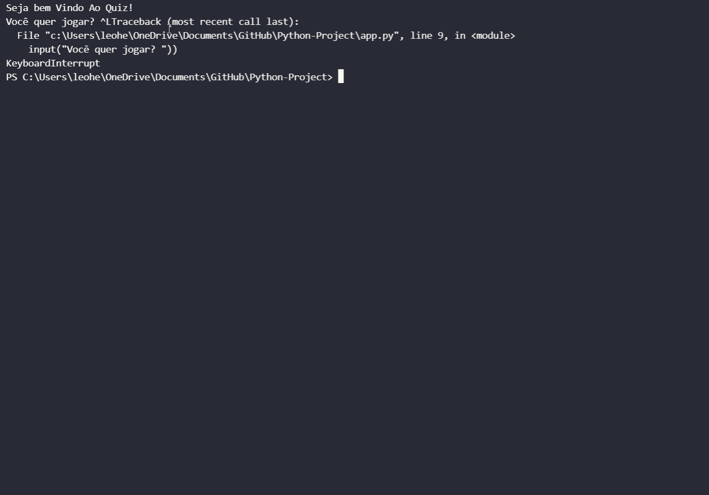

# ✔️ Project
This is a Quiz Game with 5 questions and a % that indicates how much you got right, this project was made to improve my knowledge about Python in a fun way. 

## Interface 
<h1 align="center">
    
</h1>

# 💻 Technologies
- **PYTHON**

# 📝 License
This project have the license of the [MIT](./LICENSE).
